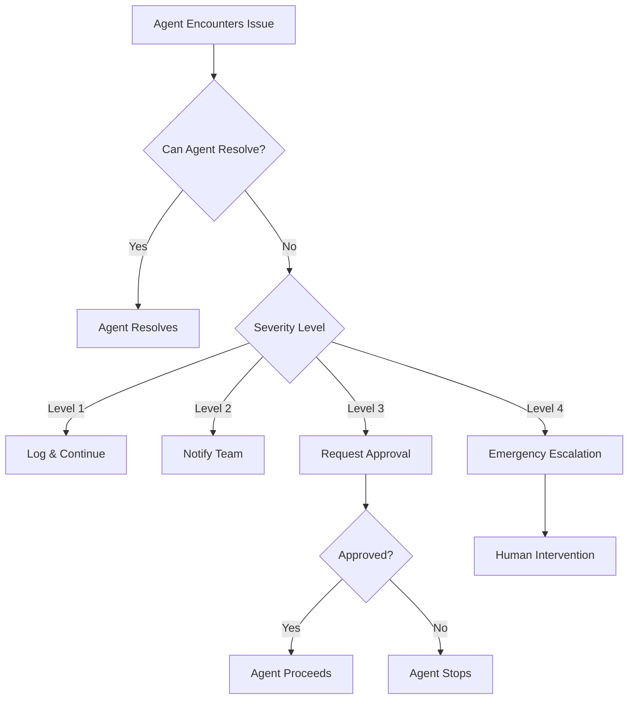

# Infinity-Matrix Collaboration Guide

## Overview

This guide defines roles, responsibilities, agent handoff protocols, and human escalation procedures for the Infinity-Matrix autonomous development system. It ensures smooth collaboration between AI agents, human developers, and stakeholders.

---

## Table of Contents

1. [Roles & Responsibilities](#roles--responsibilities)
2. [Agent Types & Specializations](#agent-types--specializations)
3. [Agent Handoff Protocols](#agent-handoff-protocols)
4. [Human Escalation](#human-escalation)
5. [Communication Channels](#communication-channels)
6. [Decision-Making Framework](#decision-making-framework)
7. [Conflict Resolution](#conflict-resolution)
8. [Quality Standards](#quality-standards)

---

## Roles & Responsibilities

### AI Agents

#### Primary Responsibilities
- Execute automated tasks from the task queue
- Generate, review, and deploy code autonomously
- Monitor system health and respond to alerts
- Perform routine maintenance and updates
- Generate reports and documentation
- Learn from feedback and improve performance

#### Operating Principles
- **Autonomy First**: Operate without human intervention when possible
- **Safety**: Never deploy changes that fail tests or security scans
- **Transparency**: Log all actions and decisions
- **Efficiency**: Optimize for speed while maintaining quality
- **Learning**: Continuously improve from past experiences

### Human Developers

#### Primary Responsibilities
- Review critical changes before production deployment
- Handle complex architectural decisions
- Resolve escalated issues from agents
- Configure agent parameters and policies
- Define new features and requirements
- Train and improve agent capabilities

#### Operating Principles
- **Trust but Verify**: Review agent work periodically
- **Provide Feedback**: Give clear feedback to improve agents
- **Set Boundaries**: Define what agents can/cannot do autonomously
- **Stay Informed**: Monitor agent activities and outcomes
- **Intervene Sparingly**: Let agents handle routine tasks

### System Administrators

#### Primary Responsibilities
- Manage infrastructure and cloud resources
- Configure credentials and access controls
- Monitor costs and optimize resources
- Handle security incidents and audits
- Ensure compliance with policies
- Maintain disaster recovery plans

### Product Owners/Stakeholders

#### Primary Responsibilities
- Define product vision and priorities
- Review and approve major changes
- Provide business requirements
- Validate deployed features
- Make strategic decisions

---

## Agent Types & Specializations

### 1. Orchestrator Agent

**Purpose**: Coordinates all other agents and manages the task queue

**Capabilities**:
- Task scheduling and prioritization
- Agent assignment and load balancing
- Workflow coordination
- Status tracking and reporting
- Conflict resolution between agents
- Resource allocation

**Autonomy Level**: High - Can make most operational decisions

**Escalation Triggers**:
- Multiple agent failures
- Conflicting agent decisions
- Resource exhaustion
- Critical system outage

### 2. Code Agent

**Purpose**: Handles all code generation, modification, and refactoring

**Capabilities**:
- Feature implementation
- Bug fixing
- Code refactoring
- Documentation generation
- Code style enforcement
- Dependency updates

**Autonomy Level**: Medium - Requires test passing before deployment

**Escalation Triggers**:
- Cannot fix failing tests after 3 attempts
- Major architectural changes needed
- Breaking changes to public APIs
- Security vulnerabilities in proposed code

### 3. Test Agent

**Purpose**: Creates and executes tests, verifies code quality

**Capabilities**:
- Unit test generation
- Integration test creation
- E2E test automation
- Test execution and reporting
- Coverage analysis
- Performance testing

**Autonomy Level**: High - Can run tests freely

**Escalation Triggers**:
- Persistent test failures
- Coverage drops below threshold (80%)
- Performance regressions detected
- Flaky tests identified

### 4. Deploy Agent

**Purpose**: Handles building, packaging, and deployment

**Capabilities**:
- Build execution
- Container creation
- Artifact management
- Deployment to environments
- Rollback execution
- Health check verification

**Autonomy Level**: Medium-High - Can deploy to staging automatically, production with approval

**Escalation Triggers**:
- Deployment failure
- Health checks failing
- Production deployment request
- Rollback needed

### 5. Monitor Agent

**Purpose**: Observes system health and responds to incidents

**Capabilities**:
- Metrics collection
- Log analysis
- Anomaly detection
- Alert generation
- Incident response
- Performance analysis

**Autonomy Level**: Medium - Can auto-remediate known issues

**Escalation Triggers**:
- Critical alerts (system down)
- Unknown error patterns
- Performance degradation
- Security incidents

### 6. Security Agent

**Purpose**: Ensures security and compliance

**Capabilities**:
- Vulnerability scanning
- Secret detection
- Dependency audit
- Security patch application
- Compliance checking
- Access control review

**Autonomy Level**: Low-Medium - Auto-applies non-breaking security patches

**Escalation Triggers**:
- Critical vulnerabilities found
- Security breach detected
- Compliance violations
- Breaking security patches needed

### 7. Optimization Agent

**Purpose**: Improves performance and reduces costs

**Capabilities**:
- Performance profiling
- Code optimization
- Resource rightsizing
- Cost analysis
- Cache optimization
- Query optimization

**Autonomy Level**: Low - Recommends changes, requires approval

**Escalation Triggers**:
- Significant cost increases
- Performance below SLA
- Resource exhaustion
- Optimization recommendations ready

---

## Agent Handoff Protocols

### Task Lifecycle

```
1. Task Created → Orchestrator Agent
2. Task Assigned → Specialized Agent
3. Task Executed → Agent performs work
4. Task Verified → Test Agent validates
5. Task Deployed → Deploy Agent releases
6. Task Monitored → Monitor Agent observes
7. Task Completed → Orchestrator Agent closes
```

### Handoff Scenarios

#### Scenario 1: Feature Implementation

```
Product Owner creates issue
    ↓
Orchestrator Agent: Prioritizes and assigns to Code Agent
    ↓
Code Agent: Implements feature and creates PR
    ↓
Test Agent: Runs all tests and quality checks
    ↓ (if tests pass)
Code Agent: Merges PR
    ↓
Deploy Agent: Builds and deploys to staging
    ↓
Test Agent: Runs E2E tests on staging
    ↓ (if E2E pass)
Deploy Agent: Deploys to production
    ↓
Monitor Agent: Watches for issues
    ↓
Orchestrator Agent: Marks task complete
```

#### Scenario 2: Bug Fix

```
User reports bug OR Monitor Agent detects issue
    ↓
Orchestrator Agent: Creates bug ticket and assigns to Code Agent
    ↓
Code Agent: Analyzes and fixes bug
    ↓
Test Agent: Verifies fix and adds regression test
    ↓
Deploy Agent: Hot-fixes to production
    ↓
Monitor Agent: Confirms issue resolved
    ↓
Orchestrator Agent: Closes ticket and notifies user
```

#### Scenario 3: Performance Issue

```
Monitor Agent: Detects performance degradation
    ↓
Orchestrator Agent: Assigns to Optimization Agent
    ↓
Optimization Agent: Profiles and identifies bottleneck
    ↓
Code Agent: Implements optimization
    ↓
Test Agent: Verifies no regressions
    ↓
Deploy Agent: Deploys optimization
    ↓
Monitor Agent: Confirms performance improved
    ↓
Orchestrator Agent: Documents optimization
```

#### Scenario 4: Security Vulnerability

```
Security Agent: Finds vulnerability (or external report)
    ↓
Orchestrator Agent: Creates high-priority ticket
    ↓
Security Agent: Assesses severity and impact
    ↓ (if critical)
ESCALATE TO HUMAN: Security team reviews
    ↓ (after approval)
Code Agent: Applies security patch
    ↓
Test Agent: Verifies fix doesn't break functionality
    ↓
Deploy Agent: Emergency deployment to all environments
    ↓
Security Agent: Confirms vulnerability patched
    ↓
Orchestrator Agent: Documents incident
```

### Handoff Communication Protocol

Agents communicate via structured messages in the task queue:

```json
{
  "task_id": "uuid",
  "from_agent": "code_agent",
  "to_agent": "test_agent",
  "action": "handoff",
  "status": "completed",
  "message": "Feature implementation complete, ready for testing",
  "artifacts": {
    "pr_url": "https://github.com/...",
    "branch": "feature/new-feature",
    "files_changed": ["src/app.js", "src/utils.js"],
    "tests_added": ["tests/app.test.js"]
  },
  "next_actions": ["run_unit_tests", "run_integration_tests"],
  "timestamp": "2025-12-30T22:00:00Z"
}
```

---

## Human Escalation

### Escalation Levels

#### Level 1: Informational (No Action Required)
- **Trigger**: Routine completions, minor issues resolved
- **Notification**: Slack message, email digest
- **Response Time**: None required
- **Examples**:
  - Dependency updates applied
  - Tests passing after fixes
  - Routine deployments successful

#### Level 2: Awareness (Review Recommended)
- **Trigger**: Non-critical issues, agent recommendations
- **Notification**: Slack message, email
- **Response Time**: Within 24 hours
- **Examples**:
  - Optimization opportunities identified
  - Minor test failures resolved automatically
  - Configuration changes suggested

#### Level 3: Action Required (Human Decision Needed)
- **Trigger**: Agent cannot proceed, needs approval
- **Notification**: Slack alert, email, SMS
- **Response Time**: Within 4 hours
- **Examples**:
  - Production deployment ready for approval
  - Breaking API changes proposed
  - Major refactoring needed
  - Cost increase detected

#### Level 4: Urgent (Immediate Attention)
- **Trigger**: Critical system issues, security incidents
- **Notification**: Phone call, SMS, Slack alert, email
- **Response Time**: Within 30 minutes
- **Examples**:
  - Production system down
  - Critical security vulnerability
  - Data loss risk
  - Major cost overrun

### Escalation Process



### Escalation Message Template

```markdown
🚨 **ESCALATION: Level {LEVEL}**

**Task**: {TASK_DESCRIPTION}
**Agent**: {AGENT_NAME}
**Issue**: {ISSUE_DESCRIPTION}

**Context**:
- Task ID: {TASK_ID}
- Started: {START_TIME}
- Attempts: {ATTEMPT_COUNT}
- Last Error: {ERROR_MESSAGE}

**Impact**:
- Affected Users: {USER_COUNT}
- Service Status: {STATUS}
- Data Risk: {RISK_LEVEL}

**Agent Recommendation**:
{RECOMMENDATION}

**Required Action**:
{REQUIRED_ACTION}

**Links**:
- Task: {TASK_URL}
- Logs: {LOG_URL}
- Dashboard: {DASHBOARD_URL}
```

---

## Communication Channels

### Slack Channels

- **#infinity-matrix-general**: General discussions and updates
- **#infinity-matrix-agents**: Agent activity logs and status
- **#infinity-matrix-alerts**: Automated alerts and notifications
- **#infinity-matrix-deploys**: Deployment notifications
- **#infinity-matrix-incidents**: Incident tracking and resolution

### Email Lists

- **team@infinityxai.com**: All team members
- **on-call@infinityxai.com**: On-call rotation for urgent issues
- **security@infinityxai.com**: Security-related notifications

### GitHub

- **Issues**: Task tracking, bugs, features
- **Pull Requests**: Code review and discussion
- **Discussions**: Architecture and design decisions
- **Projects**: Project management and roadmaps

### Supabase Dashboard

- **Task Queue**: Real-time agent task status
- **Metrics**: System performance and health
- **Logs**: Agent execution logs and errors

---

## Decision-Making Framework

### Agent Autonomous Decisions

Agents can make these decisions without human approval:

✅ **Allowed**:
- Apply dependency patch updates (non-breaking)
- Fix linting/formatting issues
- Add missing tests for existing code
- Deploy to development/staging environments
- Restart failed services (after analysis)
- Apply known fixes for known issues
- Update documentation
- Optimize database queries (after testing)

❌ **Not Allowed** (Requires Human Approval):
- Production deployments
- Breaking API changes
- Major architectural changes
- Delete/drop databases or tables
- Modify security configurations
- Change access controls
- Major dependency upgrades
- Changes affecting billing/costs

### Human Decision Authority

#### Individual Developer
- Review and merge PRs
- Approve staging deployments
- Configure agent parameters
- Debug complex issues

#### Tech Lead
- Approve production deployments
- Approve architectural changes
- Assign agent priorities
- Override agent decisions

#### Security Team
- Approve security patches
- Configure security policies
- Handle security incidents
- Audit access controls

#### Management
- Approve budget changes
- Set strategic priorities
- Define agent policies
- Approve major changes

---

## Conflict Resolution

### Agent-Agent Conflicts

When two agents have conflicting decisions:

1. **Orchestrator Agent** mediates the conflict
2. Evaluate based on:
   - Task priority
   - Risk assessment
   - Historical success rate
   - Resource availability
3. If no clear resolution: **Escalate to Human (Level 3)**

### Agent-Human Conflicts

When an agent's decision conflicts with human judgment:

1. **Human decision takes precedence**
2. Agent logs the conflict for learning
3. Human provides feedback explaining the decision
4. System updates agent decision-making parameters

### Process Conflicts

When processes deadlock or compete for resources:

1. **Orchestrator Agent** applies priority rules
2. Higher priority task proceeds
3. Lower priority task is queued or rescheduled
4. If critical: **Escalate to Human (Level 4)**

---

## Quality Standards

### Code Quality

- **Test Coverage**: Minimum 80% for new code
- **Linting**: Zero linting errors
- **Security**: Zero critical vulnerabilities
- **Performance**: No regressions
- **Documentation**: All public APIs documented

### Agent Performance

- **Task Success Rate**: >90%
- **Response Time**: <1 hour for standard tasks
- **Escalation Rate**: <10% of tasks
- **False Positives**: <5% of alerts
- **Cost Efficiency**: <$0.10 per task

### Human Review

- **Production PRs**: 100% human reviewed
- **Security Changes**: 100% security team reviewed
- **Breaking Changes**: 100% tech lead approved
- **Critical Incidents**: 100% post-mortem documented

---

## Standard Operating Procedures

### Daily Operations

```
00:00 UTC - Monitor Agent: Run daily health check
01:00 UTC - Security Agent: Scan for vulnerabilities
02:00 UTC - Optimization Agent: Analyze cost and performance
06:00 UTC - Code Agent: Apply dependency updates
08:00 UTC - Test Agent: Run full test suite
12:00 UTC - Orchestrator Agent: Generate daily report
18:00 UTC - Deploy Agent: Deploy approved changes to staging
```

### Weekly Operations

```
Monday - Planning: Review roadmap and priorities
Tuesday - Security: Security audit and patch review
Wednesday - Performance: Performance review and optimization
Thursday - Cost: Cost review and optimization
Friday - Retrospective: Review week's activities and improvements
```

### Monthly Operations

```
Week 1 - Major updates: Apply major dependency updates
Week 2 - Optimization: Performance and cost optimization sprint
Week 3 - Security: Comprehensive security audit
Week 4 - Planning: Next month's roadmap and priorities
```

---

## Emergency Procedures

### System Down

1. **Monitor Agent** detects outage
2. **Immediate Escalation** to on-call (Level 4)
3. **Deploy Agent** attempts automatic rollback
4. **Human** investigates root cause
5. **Code Agent** implements fix
6. **Deploy Agent** deploys fix
7. **Monitor Agent** confirms resolution
8. **Post-mortem** within 24 hours

### Security Breach

1. **Security Agent** detects breach or receives report
2. **Immediate Escalation** to security team (Level 4)
3. **Security Agent** isolates affected systems
4. **Human** assesses damage and scope
5. **Security Agent** revokes compromised credentials
6. **Code Agent** applies security patches
7. **Deploy Agent** deploys fixes
8. **Security Agent** confirms breach contained
9. **Incident report** and lessons learned

### Data Loss

1. **Monitor Agent** detects data loss
2. **Immediate Escalation** (Level 4)
3. **Deploy Agent** stops all deployments
4. **Human** assesses scope and impact
5. **System Administrator** restores from backup
6. **Test Agent** verifies data integrity
7. **Monitor Agent** confirms system healthy
8. **Root cause analysis** and prevention measures

---

## Feedback and Improvement

### Agent Performance Reviews

- **Weekly**: Automated performance analysis
- **Monthly**: Human review of agent decisions
- **Quarterly**: Comprehensive agent optimization

### Feedback Mechanism

Humans can provide feedback on agent actions:

```markdown
## Agent Feedback

**Task ID**: {TASK_ID}
**Agent**: {AGENT_NAME}
**Rating**: ⭐⭐⭐⭐☆ (4/5)

**What went well**:
- Quick response time
- Correct implementation
- Good test coverage

**What could be improved**:
- More detailed commit messages
- Could have considered edge case X
- Should have updated related documentation

**Specific Feedback**:
{DETAILED_FEEDBACK}
```

### Continuous Improvement

- Agents learn from feedback and adjust behavior
- Failed tasks are analyzed for root cause
- Success patterns are reinforced
- New capabilities are tested in staging first

---

## References

- [Blueprint](./docs/blueprint.md) - System architecture
- [Roadmap](./docs/roadmap.md) - Implementation plan
- [Prompt Suite](./docs/prompt_suite.md) - Agent prompts
- [System Manifest](./docs/system_manifest.md) - System inventory
- [Setup Instructions](./setup_instructions.md) - Onboarding guide

---

**Document Version**: 1.0.0  
**Last Updated**: 2025-12-30  
**Maintained By**: Infinity-Matrix System
